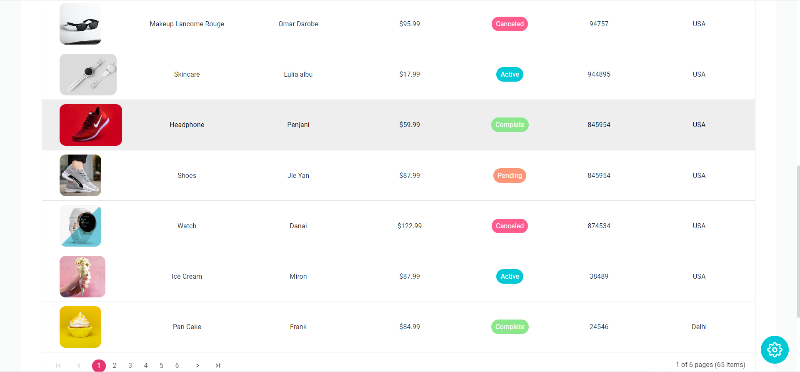

# DASHBOARD-UI

### ABOUT
***

THIS IS A DASHBOARD-UI CREATED USING REACTJS AND SYNCFUSION COMPONENTS WITH VARIOUS FEATURES SUCH AS CALENDAR, TASK MANAGEMENT BOARD, EDITOR, CHARTS, ETC.
 
WE CAN ALSO SWITCH BETWEEN LIGHT AND DARK MODE AS WELL AS SELECT COLOR THEME FROM SEVEN DIFFERENT OPTIONS FOR THE WHOLE WEBSITE.
 
[SEE LIVE](https://syncfusion-dashboard-ui.netlify.app/)

### SNAPSHOTS
***

#### ECOMMERCE PAGE OF WEBSITE

#### ORDERS SECTION OF WEBSITE

#### CALENDAR SECTION OF WEBSITE

#### KANBAN BOARD SECTION OF WEBSITE

#### CHARTS SECTION OF WEBSITE

